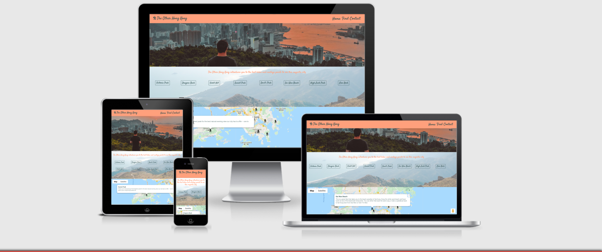
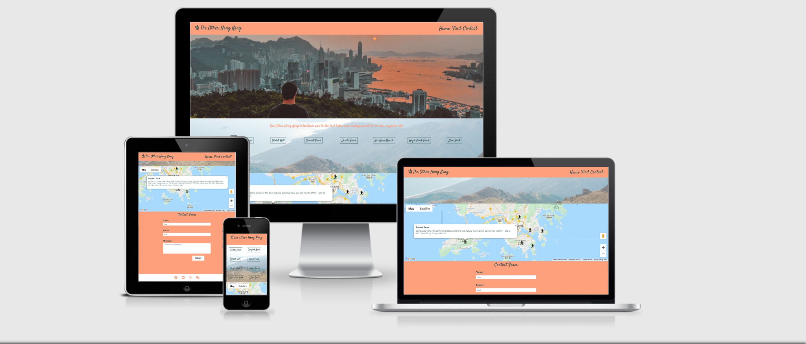
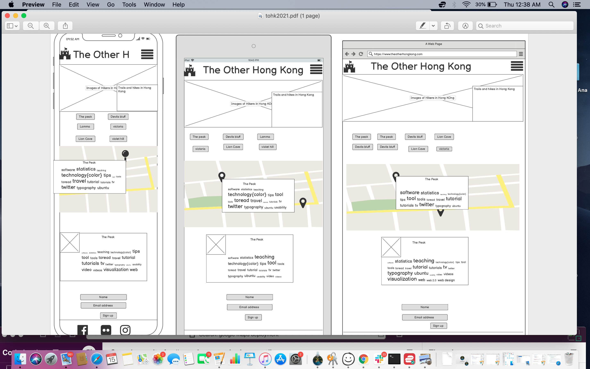
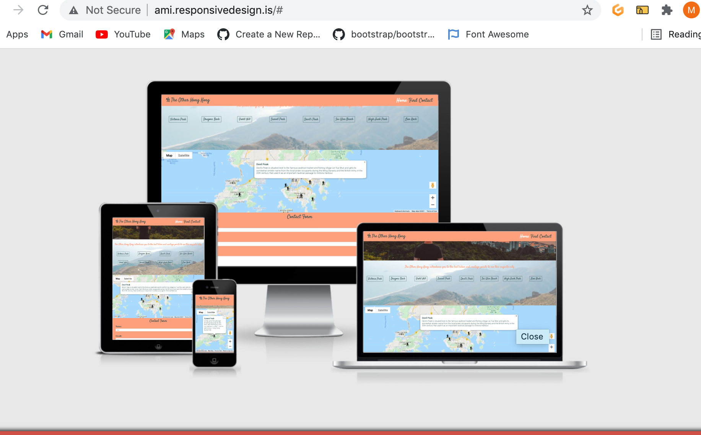
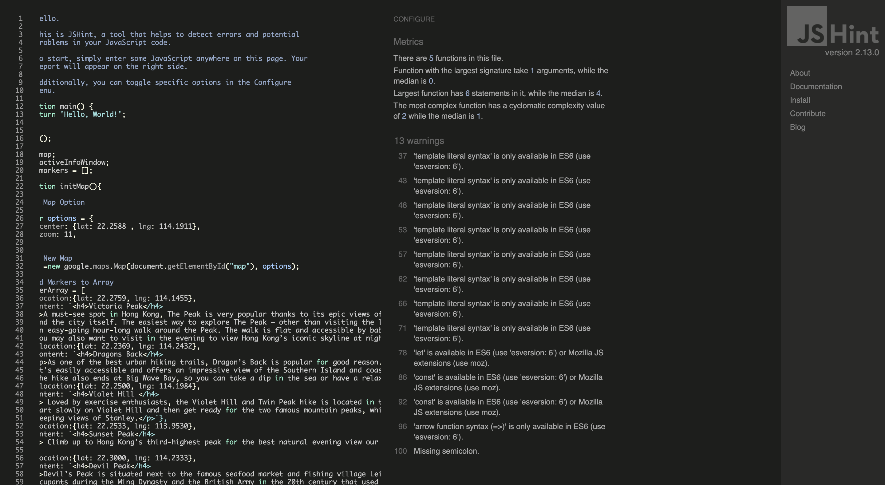
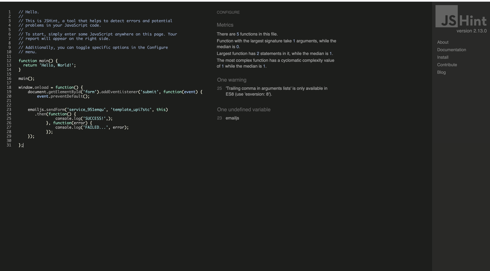

# **The Other Hong Kong**
[View a live version of The Other Hong Kong here]()
This is the main website for *The Other Hong Kong*. We aim to introduce people to the other Hong Kong. The side of Hong Kong where you can enjoy the almost 70% of National Parks, exclusives spas and yoga classes. The site is designed to be responsive and accessible on a wide range of devices. Making it easy to navigate to all the relevant content.
 "The Other Hong Kong on multiple displays"
 "The Other Hong Kong on multiple displays and showing different pages."
## Table of Contents
### [User Experience](#user-experience-(ux))
#### [User Stories](#user-stories)
* [First Time Visitor Goals](#first-time-visitor-goals)
* [Returning Visitor Goals](#returning-visitor-goals)
* [Frequent Visitor Goals](#frequent-visitor-goals)

### [Design](#design)

* [Color Scheme](#color-scheme)
* [Typography](#typography)
* [Imagery](#imagery)
* [Features](#features)
* [Wireframes](#wireframes)
### [Technologies Used](#technologies-used)
* [Languages Used](#languages-used)
* [Frameworks  Libraries and Programs Used](#frameworks-libraries-and-programs-used)
### [Deployment](#delpoyment)
* [GitHub](#github)
* [Cloning to Local Device](#cloning-of-repository-to-a-local-device)
* [Setting up a google maps javascript API](#Setting-up-a-google-maps-javascript-API)

### [Testing](#testing)
### [User Stories] (#)
[Photo story for first time user](#photo-story-for-first-time-user)
[Bugs](#bugs)
- [Gallery](#gallery)
- [Navbar](#navbar)
- [form](#form)
- [Javascript for Maps](#javascript-for-maps)
- [Javascript for mail](#javascript-for-mail)
### [Acknowledgements](#acknowledgements)
* [Media](#media)
* [Individuals](#individuals)

## User Experience (UX)
User Stories 

 
 1. First Time Visitor Goals
    a. First time visitors should be able to clearly access all links that inform the user of places to go in Hong Kong for hikes, that give impresseive views of the equally impressive city. While Hong Kong may be famous for its shopping, it can also attract those who enjoy impress views while on tough hikes. 
      
        
    b. The colours are attractive to the eye and lead the user down the page with the subtle colours that connect the different questions. An orange sun setting over a concrete gray Hong Kong.
    The Navbar in bright burnt orange with text in grey leads the reader’s gaze down through the page and the image of a hiker perched atop a ridge looking down on the concrete jungle below. This is the opposite view of hong kong that people are used to seeing. It is usually a port view of Hong Kong taken from Kowloon. Next section provides the active links that introduces the new Hong Kong on google maps. A sign up sheet is a available to allow users to receive updates on locally organised group events. Finally, the footer links to the many social media accounts that will provide further updates for the Other Hong Kong. 

        
    c. Clicking either the home page or the company logo the user will find themselves on the main landing page. 

    d. The Explore button in the navbar leads the user to main interactive component of the site. My clicking hikes, markers for five different hikes in hong kong will appear with details regarding difficulty and length of hike. 

    e. Contact will allow the user to get info to any further details about locally organised group hikes in and around Hong Kong. 

  
 2. Returning Visitor Goals 
     Returning users can access any information they may have forgotten and use the active social media sites and we chat account. 
    
3. Frequent User Goals 
    The user can become more familiar with the terrain and geography of Hong Kong.
           

# Design 
  ## Color Scheme  
  * Three main colors where chosen. These colours were inspired by the image of the sun setting over Hong Kong City. The main colour is that of pink salmon
     Colors are pinksalmon like a sunset and darkslate gray to represent the concrete jungle below.
 ## Typography 
    
  * Font used is Satisfy and cursive. I wanted something relaxed and flowing. 
 ## Imagery
  * Images used were from Unsplash and of particilar hiking locations in Hong Kong. 
  
## Features
* Responsive on all devices and have interactive elements for bookings. Icons that link to further social media updates.

## Wireframes

* Wireframe for the whole project. [View](assets/wireframes/tohk2021.pdf)

 "Home page wireframe "
"

# Technologies Used 
## Languages Used 
* HTML
* CSS
* Javascript
## Frameworks Libraries and Programs Used 
1. [Bootstrap](https://www.getbootstrap.com)
  
    Bootstrap 4.6.X:
2. Hover.css:
3.  [flaticon](https://www.flaticon.com/free-icons/hiking)
    Flaticon was used to make the logo and the map markers. 
4. [Google Fonts](https://fonts.google.com/specimen/Satisfy)
5. [Fontawesome](https://fontawesome.com/)
    Fontawesome was used for to get icons for utensils and aa cocktail on the feast page. 
6. [Gitpod](https://gitpod.io/workspaces/)
    Used gitpod to work on my repositories. 
7. [Github](https://github.com/MichelleCoffey/A_Moveable_Feast_Shanghai/tree/1a91746d21707106faef91c699500aff9414e097)
     GitHub is hosting my repositories. 
8. JQuery: 
    * Is used by Bootstrap.

9. [Balsamiq](https://balsamiq.com/)
    * Balsamiq was used to design and organise my WireFrames. 
10. [TinyPNG](https://tinypng.com/)
     * Tinypng for fomatting images, so they loaded faster.
11. [Unsplash](https://unsplash.com/)
    * Upsplash was used to access some stock images to add to the site and in particular the hero image and background image. 
12. [Google Maps API](https://developers.google.com/maps)
    * Upsplash was used to access some stock images to add to the site and in particular the galllery and carousel. 
13. [Timeout Hong Kong](https://www.timeout.com/hong-kong/sport-and-fitness/best-hikes-hong-kong)
    * Information for hikes around Hong Kong was taken from a TimeOut feature.
14. [Emailjs](https://www.emailjs.com/)
    * Emailjs was used to help the user contact the site for more information regarding hikes. 

## Deployment 
### Github
#### The repository is hosted on github and I have therefore used github pages to deploy the site. 
  1. On Github, go to your site's repository.
  2. Under your repository name, click settings and scroll down to Github pages. 
  3. Under the "Github pages:", use the None or Branch drop-down menu and select a publishing source. For a Moveable Feast, the master was selected, root and both actions were saved using the save button. A theme or custom domain were not chosen at this time. 
  4. After saving the actions. Next click the active link on the repository page on Github. Full deployment may take a minute or two, so refresh the page and be patient. 
  
#### Cloning of Repository to a local device.
  1. On GitHub, again go to the main page of the repository. 
  2. Above the ist of files, click Code. 
  3. To clone the repository using HTTPS, under "Clone with HTTPS", click. 
     To clone the repository using an SSH key, including a certificate issued by your organization's SSH certificate authority, click Use SSH, then click . 
     To clone a repository using GitHub CLI, click Use GitHub CLI, then click .
  4. Open Terminal 
  5. Change the current working directory to the location where you want the cloned directory. 
  6. TYpe git clone, and then paste the URL you copied eariler. 
  7. Press Enter to create your local clone. 

#### Cloning a repository to GitHub Desktop. 
  1. On GitHub, navigate to the main page of the repository.
  2. Above the list of files, click Code. 
  3. Click  Open with GitHub Desktop to clone and open the repository with GitHub Desktop.
  4. Follow the prompts in GitHub Desktop to complete.   

#### Setting up a google maps javascript API.

  ### Creating a project
1. To use Google Maps Platform, you must have a project to manage       services, credentials, billing, APIs, and SDKs.

2. Billing setup is required for each project, but you will only be charged if a project exceeds its free quota.

3. To create a Cloud project with billing enabled:
   Create a new Google Cloud project in the Cloud Console:

    - Create new project

    - On the New Project page, fill in the required information:

    - Project name: Accept the default or enter a customized name.

    - You can change the project name at any time. For more information, see Identifying projects.

    - Project ID: Accept the default or click EDIT to enter a customized ID that Google APIs use as a unique identifier for your project.

    - After you create the project, you cannot change the project ID, so choose an ID that you'll be comfortable using for the lifetime of the project. Don't include any sensitive information in your project ID.

    - Billing account: Select a billing account for the project. If you haven't set up a billing account or only have one billing account, you won't see this option.

    - You must be a Billing Account Administrator or Project Billing Manager to associate a project with a billing account. For more information, see the billing access control documentation.

    - Location: If you have an organization you want to link your project to, click Browse and select it; otherwise, choose "No organization".

### Enabling billing
1. To deploy your apps, you must enable billing. Your account will   not be charged if you stay within your free quota. If your application needs resources that exceed the free quota, you will be charged for the additional usage.

  2.  If you have a billing account when you create a Cloud project, then billing is automatically enabled on that project.

  3.  To enable billing on a Cloud project:

   - In the Cloud Console, go to the Billing page:

   - Go to the Billing page

  - Select or create a Cloud  project.

  -  Depending on if a billing account exists or if the selected Cloud project is associated with an account, the Billing page displays one of the following:

  -  If billing is already enabled for the selected Cloud project, then the details about the billing account are listed.

  -  If no billing account exists, you are prompted to create a billing account and associate it with the selected Cloud project.

  -  If a billing account exists, you are prompted to enable billing if the selected Cloud project is not already associated with a billing account. You can also click Cancel and then click Create account to create and associate a new billing account.

- After you enable billing, there is no limit to the amount that you might be charged. To gain more control over your costs, you can create a budget and set alerts. For more information, see Billing.

### Creating API keys
1. The API key is a unique identifier that authenticates requests associated with your project for usage and billing purposes. You must have at least one API key associated with your project.

2. To create an API key:

3. Go to the Google Maps Platform > Credentials page.

4. Go to the Credentials page

5. On the Credentials page, click Create credentials > API key.
The API key created dialog displays your newly created API key.
Click Close.
The new API key is listed on the Credentials page under API keys.
(Remember to restrict the API key before using it in production.)

### Restricting API keys
1. Restricting API keys adds security to your application by ensuring only authorized requests are made with your API key. We strongly recommend that you follow the instructions to set restrictions for your API keys. For more information, see API security best practices.

2. To restrict an API key:

3. Go to the Google Maps Platform > Credentials page.

4. Go to the Credentials page

- Select the API key that you want to set a restriction on. The API key property page appears.
- Under Key restrictions, set the following restrictions:
Application restrictions:
To accept requests from the list of website that you supply, select HTTP referrers (web sites) from the list of Application restrictions.
Specify one or more referrer web sites. For example, *.google.com accepts all sites ending in google.com, such as https://developers.google.com.
Note: file:// referers need a special representation to be added to the key restriction. The "file://" part should be replaced with "__file_url__" before being added to the key restriction. For example, "file:///path/to/" should be formatted as "__file_url__//path/to/*". After enabling file:// referers, it is recommended you regularly check your usage, to make sure it matches your expectations.

4. API restrictions:
Click Restrict key.
Select Maps JavaScript API from Select APIs dropdown. If the Maps JavaScript API is not listed, you need to enable it.
If your project uses Places Library, also select Places API. Similarly, if your project uses other services in the JavaScript API (Directions Service, Distance Matrix Service, Elevation Service, and/or Geocoding Service), you must also enable and select the corresponding API in this list.
5. To finalize your changes, click Save.

### Adding the API key to your request
- You must include an API key with every Maps JavaScript API request. In the following example, replace YOUR_API_KEY with your API key.

## EmailJS
### Connecting email service

- To connect an email service:

* Open Email Services (opens new window)page in EmailJS dashboard
  Choose from the list of supported services and click on the service
  Fill out the service details
  Test the email service and make sure you receive the test email

- To create an email template:

* Open the Email Templates (opens new window)page in EmailJS dashboard
  Click the Create New Template button
  Fill out the template properties
  Test the template either via the Test dialog, or by opening the auto-generated JSFiddle, which allows you to see the code example, and to easily fill out the template parameters and send the email.

## Testing 

### Photo story for first time user

### User Stories

  "The Other Hong Kong on multiple displays"
 
   "Feast page on multiple devices. "

  The home page greets you with a sunset over Hong Kong and a challenge to climb the mountains you usually see on the way to work. 

  
  As the user scrolls dowm, the will find buttons the link to markers and infowindows on the map. The infowindows will introduce the more exciting part of Hong Kong, some history about the locations and the vistas you can expect to view. 

   "Contact page on multiple devices. "

  The user will have the oppourtunity to register there interest in hikes. 

 "Home Page HTML success."

W3C CSS Validator Services was used to validate CSS.

 "Home Page HTML success."
 * the flexbox that was pinged was actually necassary for the image and remained in the CSS.

 "Home Page HTML success."

 "Home Page HTML success."

 "Lighthouse score for the websites user efficency."

### Bugs
#### Gallery

1. Images were a little big so I used tinypng to compress them. 
2. I used an hiking icon in the map and I got and figured out how to use this by downloading a small px hiker. 

#### Navbar
* Had a glitch that made the toggler appear at all times. This was remedied by comparing my code and bootstraps code for responsive togglers. I was able to find the error in the html. 
 #### Form 
 * The form pushed left on small devices. I removed the width of 400px, which helped and then targeted the media query on larger devices. 

 #### Javascript for Maps

 * My mentor recommended a youtube tutorial by Sam Codes that help with my ideas and intial coding for markers and infowindows. 

 [Sam Codes](https://www.youtube.com/watch?v=uPhWSyRqQDA)

 * I then needed to link the buttons with the markers and infowindows. This was helped with tutors and with Stackoverflow onclick explanations. This caused an issue when I put function within let markers within the init map function when it needed to go before it.

 * Finally I needed to make sure a window would close when a new one was opened. This was also achieved by looking at another W3schools tutorial. [Stackoverflow](https://stackoverflow.com/questions/2223574/google-maps-auto-close-open-infowindows)

 #### Javascript for Mail
 * My initial mail wouldn't work or was sending it when the page opened, without any input. I then had to add windowonload before the function and this worked. 
## Acknowledgements
### Media
* Code Institute Tutorials for providing a jumping off block. 
 * Slack for being a great source of help with either googling or when other students have provided suggestions to help improve your work. 
 * Code Institute Tutorials. 
 ### Individuals
 * My Mentor, Precious Ijege. 
 * Tutors at Code Institute are great guiding hand.   They do not give you the answer but ask the right questions to lead you down the correct path. It also helps build confidence. 
 * Anne Greaves and Code Institute for a comprehensive guide to writing README.md. The template was taken from the Code Institute Guide to writing README and how to write Markdown.
 * I have also used elements and the template of my first read, such as the table of contents. 
 * Alex Harvey, a guide to writing a table of contents in gitpod. 

#### Code
 As mentioned in bugs. 
 * My mentor recommended a youtube tutorial by Sam Codes that help with my ideas and intial coding for markers and infowindows. 

 [Sam Codes](https://www.youtube.com/watch?v=uPhWSyRqQDA)

 * I then needed to link the buttons with the markers and infowindows. This was helped with tutors and with Stackoverflow onclick explanations. This caused an issue when I put function within let markers within the init map function when it needed to go before it.

 * Finally I needed to make sure a window would close when a new one was opened. This was also achieved by looking at another W3schools tutorial. [Stackoverflow](https://stackoverflow.com/questions/2223574/google-maps-auto-close-open-infowindows)

 #### Javascript for Mail
 * My initial mail wouldn't work or was sending it when the page opened, without any input. I then had to add windowonload before the function and this worked. 
