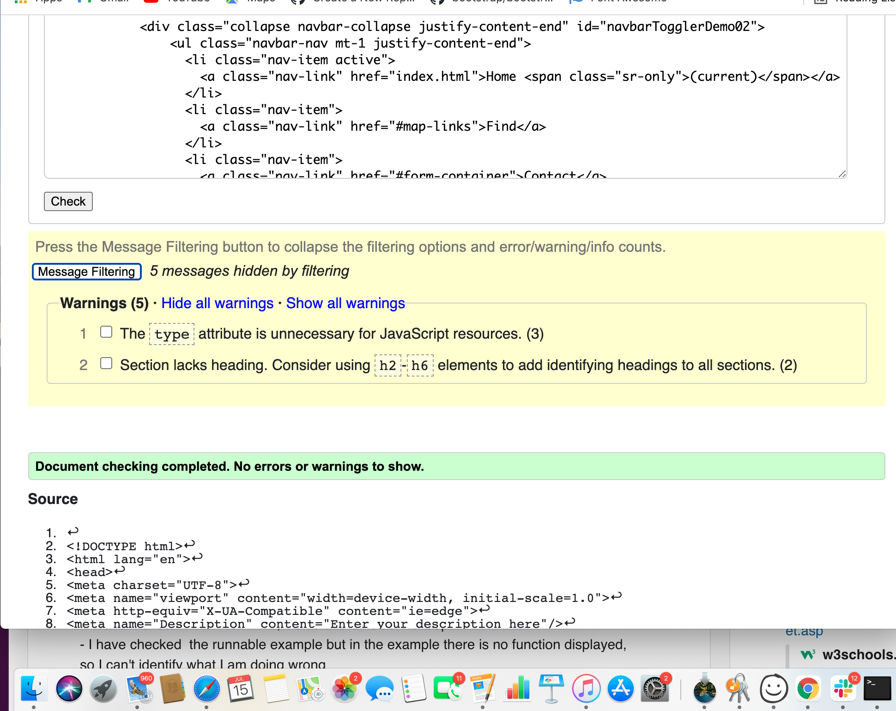
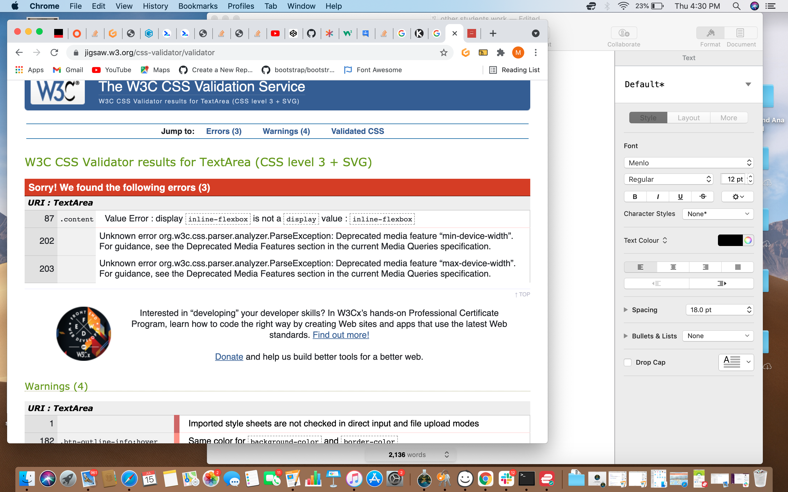
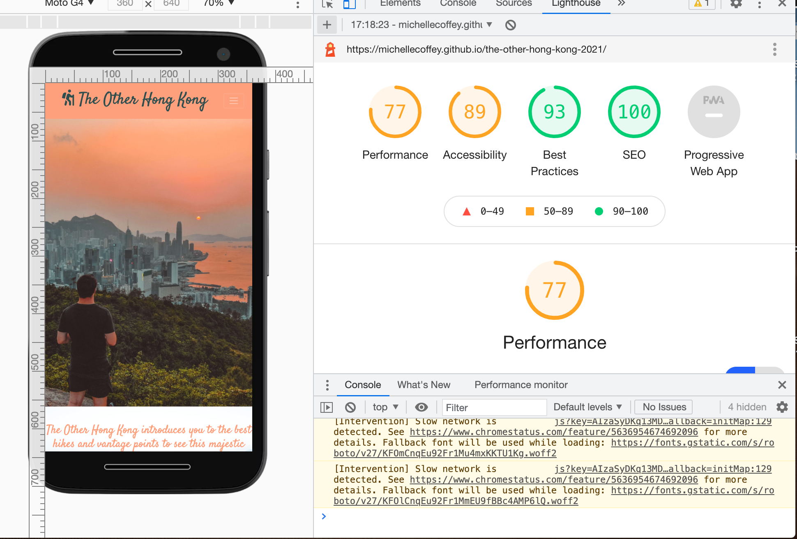

# **The Other Hong Kong**
[View a live version of The Other Hong Kong here]()
This is the main website for *The Other Hong Kong*. We aim to introduce people to the other Hong Kong. The side of Hong Kong where you can enjoy the almost 70% of National Parks, exclusives spas and yoga classes. The site is designed to be responsive and accessible on a wide range of devices. Making it easy to navigate to all the relevant content.
 "The Other Hong Kong on multiple displays"
 "The Other Hong Kong on multiple displays and showing different pages."
## Table of Contents
### [User Experience](#user-experience-(ux))
#### [User Stories](#user-stories)
* [First Time Visitor Goals](#first-time-visitor-goals)
* [Returning Visitor Goals](#returning-visitor-goals)
* [Frequent Visitor Goals](#frequent-visitor-goals)

* [Photo story for first time user](#photo-story-for-first-time-user)

### [Design](#design)

* [Color Scheme](#color-scheme)
* [Typography](#typography)
* [Imagery](#imagery)
* [Features](#features)
* [Wireframes](#wireframes)
### [Technologies Used](#technologies-used)
* [Languages Used](#languages-used)
* [Frameworks  Libraries and Programs Used](#frameworks-libraries-and-programs-used)
### [Deployment](#delpoyment)
* [GitHub](#github)
* [Cloning to Local Device](#cloning-of-repository-to-a-local-device)
* [Cloning to a Desktop](#cloning-a-repository-to-github-desktop)
### [Testing](#testing)
[Bugs](#bugs)
- [Gallery](#gallery)
- [Navbar](#navbar)
- [form](#form)
### [Acknowledgements](#acknowledgements)
* [Media](#media)
* [Individuals](#individuals)
## User Experience (UX)
* User Stories 
 
 1. First Time Visitor Goals
    a. First time visitors should be able to clearly access all materials that inform the user of possible events organised by A Moveable Feast. 
        There is an alert for covid related information that opens on a new page. The logo is clickable and the navbar contains links to the homepage, 
        feast (info regarding events), a gallery and a signup sheet. 
        
    b. The colours are attracted to the eye and do not detracted from the images.  On the homepage 
        or landing page the new user will learn about A Moveable Feast's hope to connect people to great new food and beverage offerings arouned the Shanghai. The 
        footer links to all social media links including facebook, twitter, instagram and wechat.
    
        
    c. Upon clicking the Feast page you see the offerings of local food nights, international food and drinks night. The utensil icons and cocktail icon also link to the sign up page.
    d. The sign up page is a smiple box that asks for the first user to sign up to receive invites to nights out in different restaurants. The user is encouraged to choose their preference between local, international and a bar night. 
    e. Finally the gallery page shows images of the many different types of food on offer as a means of enticing the new customer. 
    f. The pdf alert is there to offer reasurance to the user. It also has a QR code link to the city tracking app and a moveable feasts wechat account where customers can easily meassge any queries. 
 2. Returning Visitor Goals 
     Returning users can access any information they may have forgotten and use the active social media sites and we chat account. 
    
3. Frequent User Goals 
    This is static site so less things will change and there will be little need for frequent users. Users can return to check if any images have been updated. 
          
 ### Photo story for first time user

  "A Moveable Feast on multiple displays"
  The user will find images of the city, food and market dining options. There is also an easy to use navbar that links easily to the gallery, dining option informationa and finally the contact section. The landing page also explains the idea behind the website and the idea of making it easier to intruducing new food to tourists living in Shanghai. Due to Covid many people are concerned over eating in public or especially dining out with strangers. This alsert is hopefully temporary but guides the user to QR codes that help register the health info of the user but also an account for further information. 

  "Covid19 safety information PDF"

  In this time of Covid19, the user will find an alert regarding practices and safety measures. 
  This links to a pdf with two QR codes. One QR code is for the WECHAT account and gives the user 
  the oppourtunity to contact A Moveable Feast regarding concerns about dining out. The second is 
  QR for registering your Health status as required by Shanghai Municipality and restaurants.
  The alert can also be removed and does not affect the site, when things change for the better. 

   "Feast page on multiple devices. "

  The user will find info with a picture connected to each dining option. Should they want local food, 
  international food or to find a new drinking spot. Each option also has an icon of either cutlery or 
  a cocktail glass that links to the signup page. 

   "Gallery page on multiple devices. "

  The user will find examples of the many delectable foods on offer around Shanghai. 

   "Contact page on multiple devices. "

  The user is given the oppourtunity to register and request further information regarding nights out in Shanghai. 
# Design 
  ## Color Scheme  
  * Three main colors where chosen. Two were blue hues while the final is a white background. This a food based website, 
     so the added effect of text and images on a white background was to give  the illusion of  menu. The color was also inspired by the logo itself.  
     Colors are #13baec, white,  and #1339e4.
 ## Typography 
    
  * Font used is Montserrat. It has a long history, is easy to read and suits the concept of a food website. Sans Serif should be the fall back font as is the industry standard and is compatible on most devices. 
 ## Imagery
  * Images used were some of my own and also stock images taken from unsplash. The images were used to first engage with the food images and then with those who participate in the events and finally with the different types of restaurtant. 
    Images must depict diverse tastes and interests in order to attract a many and varied crowd. 
  
## Features
* Responsive on all devices and have interactive elements for bookings. Icons that link to further social media updates.

## Wireframes

* Wireframe for the whole project. [View](wireframe/amf.pdf)
* Wireframe for the whole project. [View](wireframes/amf.pdf)

 "Home page wireframe "
"

# Technologies Used 
## Languages Used 
* HTML
* CSS
## Frameworks Libraries and Programs Used 
1. [Bootstrap](https://www.getbootstrap.com)
  
    Bootstrap 4.6.X:
2. Hover.css:
3.  [Wix](https://www.wix.com/)
    Wix was used to make the logo for A moveable Feast. 
4. [Google Fonts](https://fonts.google.com/specimen/Montserrat?preview.text_type=custom)
5. [Fontawesome](https://fontawesome.com/)
    Fontawesome was used for to get icons for utensils and aa cocktail on the feast page. 
6. [Gitpod](https://gitpod.io/workspaces/)
    Used gitpod to work on my repositories. 
7. [Github](https://github.com/MichelleCoffey/A_Moveable_Feast_Shanghai/tree/1a91746d21707106faef91c699500aff9414e097)
     GitHub is hosting my repositories. 
8. JQuery: 
    * Is used by Bootstrap.
9. [Balsamiq](https://balsamiq.com/)
    * Balsamiq was used to design and organise my WireFrames. 
10. [TinyPNG](https://tinypng.com/)
     * Tinypng for fomatting images, so they. loaded faster.
11. [Unsplash](https://unsplash.com/)
    * Upsplash was used to access some stock images to add to the site and in particular the galllery and carousel. 
## Deployment 
### Github
#### The repository is hosted on github and I have therefore used github pages to deploy the site. 
  1. On Github, go to your site's repository.
  2. Under your repository name, click settings and scroll down to github pages. 
  3. Under the "Github pages:", use the None or Branch drop-down menu and select a publishing source. For a Moveable Feast, the master was selected, root and both actions were saved using the save button. A theme or custom domain were not chosen at this time. 
  4. After saving the actions. Next click the active link on the repository page on github. Full delpoyment may take a minute or two, so refresh the page and be patient. 
  
#### Cloning of Repository to a local device.
  1. On GitHub, again go to the main page of the repository. 
  2. Above the ist of files, click Code. 
  3. To clone the repository using HTTPS, under "Clone with HTTPS", click. 
     To clone the repository using an SSH key, including a certificate issued by your organization's SSH certificate authority, click Use SSH, then click . 
     To clone a repository using GitHub CLI, click Use GitHub CLI, then click .
  4. Open Terminal 
  5. Change the cirrent working directory to the location where you want the cloned directory. 
  6. TYpe git clone, and then paste the URL you copied eariler. 
  7. Press Enter to create your local clone. 

#### Cloning a repository to GitHub Desktop. 
  1. On GitHub, naviagte to the main page of the repository.
  2. Above the list of files, click Code. 
  3. Click  Open with GitHub Desktop to clone and open the repository with GitHub Desktop.
  4. Follow the prompts in GitHub Desktop to complete.   

## Testing 
HTML Code Testing was provided by W3C MarkUp Markup Validation Services. I have removed the warning because nottes were flagged because of "--".
 "Home Page HTML success."

W3C CSS Validator Services was used to validate CSS.

 "Home Page HTML success."

 "Lighthouse score for the websites user efficency."

### Bugs
#### Gallery

1. 
2. 
3. 
#### Navbar
* Because the logo was designed on Wix and was white, I had to target the color because bootstrap overrides the border color. 
  I did this by making the navbar background-color white in the style sheet. 
 #### Form 
 * This was the most difficult to control but by making the margin: auto it became responsive and also by adding d-flex from bootstrap. 

## Acknowledgements
### Media
* Code Institute Tutorials for providing a jumping off block. 
 * Slack for being a great source of help with either googling or when other students have provided suggestions to help improve your work. 
 ### Individuals
 * My Mentor, . 
 * Tutors at Code Institute are great guiding hand.   They do not give you the answer but ask the right questions to lead you down the correct path. It also helps build confidence. 
 * Anne Greaves and Code Institute for a comprehensive guide to writing README.md. The template was taken from the Code Institute Guide to writing README and how to write Markdown.
 * Alex Harvey, a guide to writing a table of contents in gitpod. 
#### Code
* 

